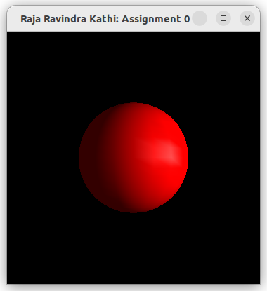
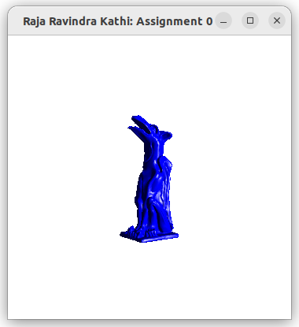
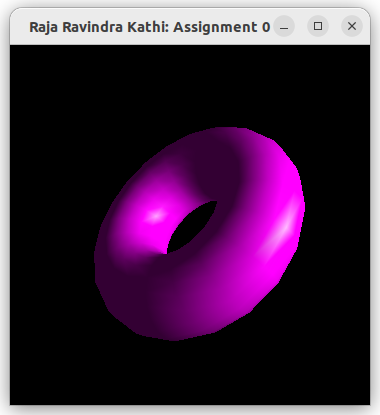
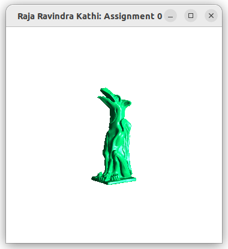

# Using OpenGL 

### Name: Raja Ravindra Kathi

### Collaboration: 
None for now!

### References:
- https://www.youtube.com/watch?v=CpEfHhSpQrw&ab_channel=Kh%C3%A1nhNguy%E1%BB%85n
- AI Chatbots to understand concepts and existing code

### Known Problems: 
No problems, works with all features as asked.

### Comments: 
Learning was a bit steep without foundational knowledge. Fun YES! Learning YES! Not sure when you will scale me to a level of making that Marvel movie you have shown in intro class but I am waiting patiently with lot of hopes. As long as this expectation is met, it won't be a waste of time. Thanks for very detailed requirements sheet. 
- I have tried adding a rotation feature like you did in sample output file and it works perfect.
- I have also added feature to change background. 
- Adding to all that if you ever want to see teapot again, hit 't'. Ofcourse you still need to load one obj file everytime then switch.

### To run:
You need to specify the object file to load at all times like below:

`./assignment_0 < torus.obj`

## Screenshots:

- 2.1 Color Change 

- 2.2 Lighting Changes

- 2.3 Load New Objects
 